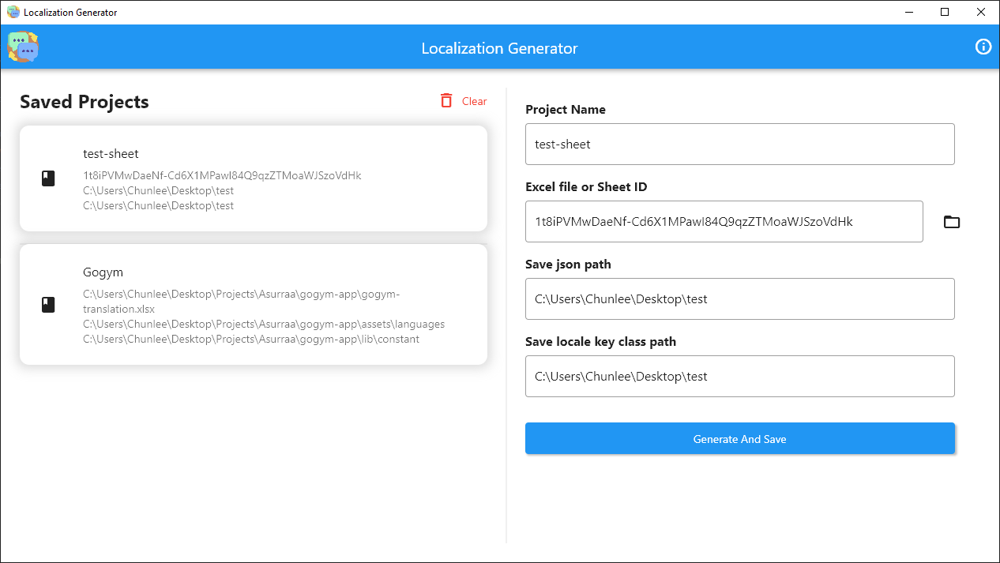

# Localization Generator

Generate json localization file from excel sheet

This app is intended to use to easy_localization package, but you can aslo use it with another localization package with json base file.

## How to use

- create an excel sheet and rename sheet's name to **Translation**
- Create sheet data structure like below or you can check file **translation_example.xlsx** in this repo

| Key         | en-US       | km-KH   | es-ES          | th-TH | vi-VN  |
| ----------- | ----------- | ------- | -------------- | ----- | ------ |
| title       | Title       | ចំណងជើង | titulo         | dgh   | dfghjk |
| buy_account | Buy Account | ទិញគណនី | comprar cuenta | sfgg  | evsd   |
| cancel      | Cancel      | បោះបង់  | asdfaf         | add   | dfrw   |

- Open this app and input all required field:

  - project name: unique name for your project history
  - excel file: path to your excel file
  - json path: path where you want to save your json files
  - locale key path: path where you want to save your LocaleKeys class

- you will get json files base on many languages you define in your excel file in a key row
- a static class **LocaleKeys** to access your json key.

## Usage

Using with easy_localization package: `Text(LocaleKeys.title.tr())`

## Screenshot

## Mac zip command

ditto -ck -rsrc --sequesterRsrc --keepParent "Localization Generator.app" localization-generator-macos.zip

## Localization Generator

- Author: Chunlee Thong
- Contributor: Chunlee Thong

Copyright (c) 2022 Chunlee Thong
